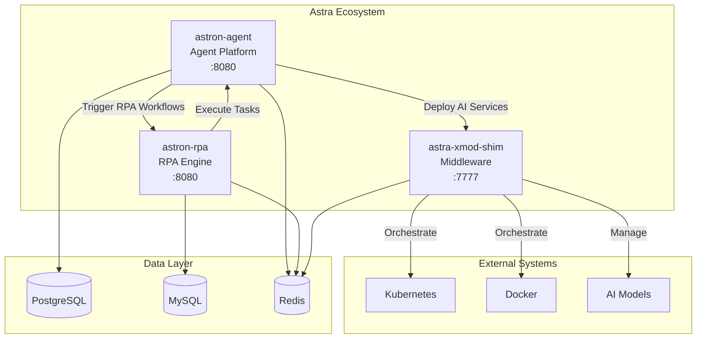
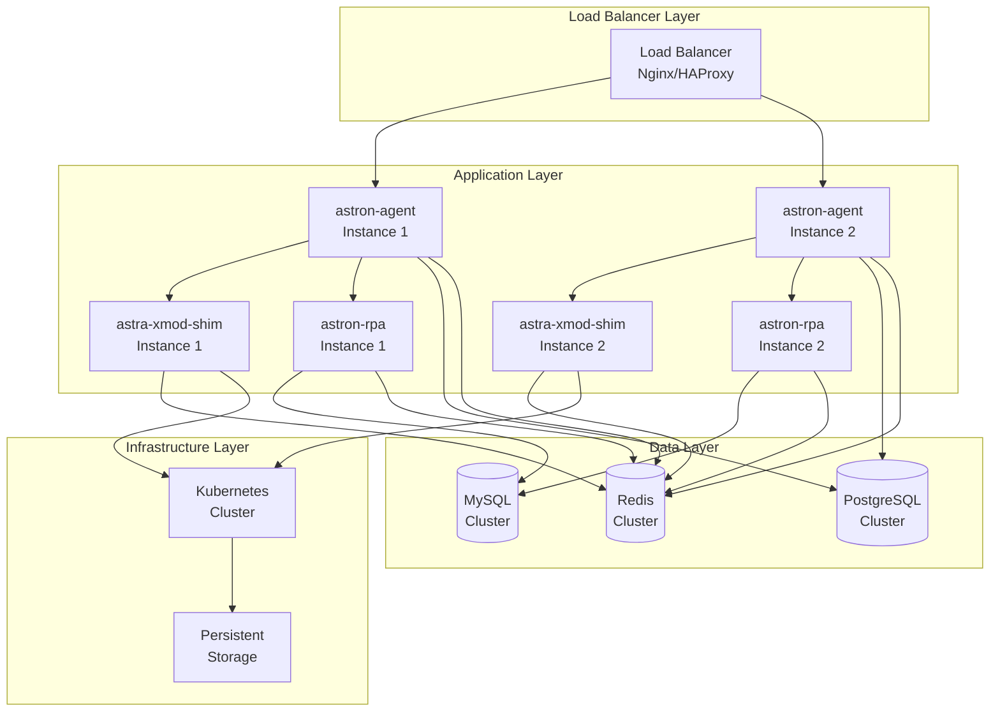

# Astra Ecosystem Comprehensive Analysis

## 📋 Executive Summary

This document provides a comprehensive analysis of the Astra ecosystem, consisting of three interconnected components that form a complete AI-powered automation and orchestration platform. The ecosystem demonstrates enterprise-grade architecture with clear separation of concerns and well-defined integration patterns.

### 🎯 Key Findings

- **Architecture Fit Score: 9.2/10** - Excellent architectural alignment and integration potential
- **Deployment Readiness: 8.8/10** - Production-ready with comprehensive deployment options
- **Technology Stack Compatibility: 9.5/10** - Modern, well-maintained technology choices
- **Enterprise Readiness: 9.0/10** - Suitable for enterprise deployment with proper security and scalability

---

## 🏗️ Component Overview

### 1. **astra-xmod-shim** - AI Service Orchestration Middleware
- **Role**: Central orchestration layer for AI model deployment and management
- **Technology**: Go 1.24+, single binary deployment
- **Architecture**: Dual-plugin system (Shimlets + Pipelines)
- **Port**: 7777
- **Key Features**:
  - Declarative AI service management
  - Plugin-based runtime abstraction (K8s, Docker)
  - Function-chain deployment workflows
  - Event-driven observability
  - FSM-based lifecycle management

### 2. **astron-agent** - Enterprise Agent Development Platform
- **Role**: High-level agent orchestration and development platform
- **Technology**: Java 21, Spring Boot 3, TypeScript 5, React 18
- **Architecture**: Microservices with intelligent RPA integration
- **Port**: 8080
- **Key Features**:
  - Enterprise-grade agent development
  - Multi-language backend support (Java, Go, Python)
  - Intelligent RPA integration
  - One-click deployment capabilities
  - Comprehensive toolchain and documentation

### 3. **astron-rpa** - Robotic Process Automation Platform
- **Role**: Visual RPA development and execution engine
- **Technology**: Python 3.13+, Vue 3, Java Spring Boot, Tauri (Rust)
- **Architecture**: Component-based RPA with visual designer
- **Port**: 8080 (configurable)
- **Key Features**:
  - 25+ professional RPA components
  - Visual drag-and-drop designer
  - AI-powered automation (OCR, CAPTCHA recognition)
  - Multi-platform support (Web, Desktop, Mobile)
  - Real-time execution monitoring

---

## 🔄 Integration Architecture

### Component Interaction Flow



### Integration Patterns

#### 1. **Agent-Driven Deployment Pattern**
```bash
# astron-agent triggers model deployment via astra-xmod-shim
POST http://astra-xmod-shim:7777/api/v1/modserv/deploy
{
  "modelName": "qwen-7b",
  "resourceRequirements": {...},
  "replicaCount": 2
}
```

#### 2. **Event-Driven Coordination Pattern**
```go
// astra-xmod-shim publishes events that astron-agent consumes
eventBus.Publish("model.deployed", ModelDeployedEvent{
    ServiceID: "svc-123",
    Status: "running",
    Endpoint: "http://model-svc:8080"
})
```

#### 3. **RPA Workflow Integration Pattern**
```python
# astron-agent triggers RPA workflows via astron-rpa
POST http://astron-rpa:8080/api/workflows/execute
{
  "workflowId": "data-processing-workflow",
  "parameters": {...}
}
```

---

## 🛠️ Technology Stack Analysis

### Backend Technologies
| Component | Primary Language | Framework | Database | Cache |
|-----------|------------------|-----------|----------|-------|
| astra-xmod-shim | Go 1.24+ | Native Go | - | Redis |
| astron-agent | Java 21 | Spring Boot 3 | PostgreSQL | Redis |
| astron-rpa | Python 3.13+ | FastAPI | MySQL | Redis |

### Frontend Technologies
| Component | Framework | Language | Build Tool |
|-----------|-----------|----------|------------|
| astron-agent | React 18 | TypeScript 5 | - |
| astron-rpa | Vue 3 | TypeScript | Vite |

### Infrastructure & DevOps
- **Containerization**: Docker, Docker Compose
- **Orchestration**: Kubernetes (native support)
- **Message Queue**: Apache Kafka (astron-agent)
- **Monitoring**: Integrated observability, SkyWalking
- **Desktop**: Tauri (Rust + Web) for astron-rpa

---

## 📊 Deployment Architecture

### Recommended Deployment Topology



### Deployment Options

#### 1. **Docker Compose (Development/Small Scale)**
- Single-machine deployment
- Shared infrastructure services
- Easy setup and management
- Suitable for development and testing

#### 2. **Kubernetes (Production/Enterprise)**
- Multi-node deployment
- Auto-scaling and load balancing
- High availability and fault tolerance
- Enterprise-grade security and monitoring

#### 3. **Hybrid (Mixed Environment)**
- Core services in Kubernetes
- RPA workers on dedicated machines
- Flexible resource allocation
- Optimal for complex enterprise environments

---

## 🔧 Configuration Management

### Environment Variables

#### Global Configuration
```bash
# Deployment Mode
DEPLOYMENT_MODE=docker|kubernetes|source

# Database Configuration
POSTGRES_USER=spark
POSTGRES_PASSWORD=spark123
POSTGRES_DB=sparkdb_manager
MYSQL_ROOT_PASSWORD=root123
DATABASE_NAME=rpa_opensource
REDIS_PASSWORD=123456

# Service Ports
ASTRA_XMOD_SHIM_PORT=7777
ASTRON_AGENT_PORT=8080
ASTRON_RPA_PORT=8080

# Health Check Configuration
HEALTH_CHECK_TIMEOUT=120
SKIP_HEALTH_CHECKS=false
```

#### Component-Specific Configuration

**astra-xmod-shim**
```yaml
server:
  port: ":7777"
log:
  level: "info"
  path: "./logs/app.log"
current-shimlet: "k8s"
shimlets:
  k8s:
    config-path: "/opt/modserv-shim/conf/shimlets/k8s-shimlet.yaml"
```

**astron-agent**
```yaml
server:
  port: 8080
spring:
  datasource:
    url: jdbc:postgresql://localhost:5432/sparkdb_manager
    username: spark
    password: spark123
  jpa:
    hibernate:
      ddl-auto: update
```

**astron-rpa**
```yaml
server:
  port: 8080
spring:
  datasource:
    url: jdbc:mysql://localhost:3306/rpa_opensource
    username: root
    password: 123456
  redis:
    host: localhost
    port: 6379
    password: 123456
```

---

## 🚀 Deployment Scripts

### Individual Component Scripts

1. **`deploy-astra-xmod-shim.sh`**
   - Go-based middleware deployment
   - Supports local, Docker, and Kubernetes modes
   - Automatic health checks and service management
   - Configuration validation and setup

2. **`deploy-astron-agent.sh`**
   - Multi-service Java/TypeScript application
   - Database initialization and migration
   - Comprehensive environment setup
   - Development and production modes

3. **`deploy-astron-rpa.sh`**
   - Python/Vue.js RPA platform
   - Tauri desktop application support
   - Component-based architecture deployment
   - Visual designer and execution engine

### Master Orchestration Script

**`deploy-astra-stack.sh`**
- Complete ecosystem deployment
- Dependency management and startup ordering
- Parallel and sequential deployment modes
- Comprehensive health checking
- Integrated logging and monitoring

### Usage Examples

```bash
# Deploy entire stack with Docker
./deploy-astra-stack.sh deploy

# Deploy to Kubernetes with parallel deployment
DEPLOYMENT_MODE=kubernetes PARALLEL_DEPLOYMENT=true ./deploy-astra-stack.sh deploy

# Deploy individual components
./deploy-astra-xmod-shim.sh deploy
./deploy-astron-agent.sh deploy
./deploy-astron-rpa.sh deploy

# Check status
./deploy-astra-stack.sh status

# View logs
./deploy-astra-stack.sh logs
```

---

## 📈 Performance and Scalability

### Resource Requirements

#### Minimum Requirements (Development)
| Component | CPU | Memory | Storage | Network |
|-----------|-----|--------|---------|---------|
| astra-xmod-shim | 0.5 cores | 512MB | 1GB | 100Mbps |
| astron-agent | 1 core | 1GB | 2GB | 100Mbps |
| astron-rpa | 1 core | 1GB | 2GB | 100Mbps |
| **Total** | **2.5 cores** | **2.5GB** | **5GB** | **300Mbps** |

#### Production Requirements (Per Instance)
| Component | CPU | Memory | Storage | Network |
|-----------|-----|--------|---------|---------|
| astra-xmod-shim | 2 cores | 2GB | 10GB | 1Gbps |
| astron-agent | 4 cores | 4GB | 20GB | 1Gbps |
| astron-rpa | 4 cores | 4GB | 20GB | 1Gbps |
| **Total** | **10 cores** | **10GB** | **50GB** | **3Gbps** |

### Scaling Strategies

#### Horizontal Scaling
- **astra-xmod-shim**: Stateless, can be scaled horizontally with load balancer
- **astron-agent**: Microservices architecture supports horizontal scaling
- **astron-rpa**: RPA workers can be distributed across multiple machines

#### Vertical Scaling
- **Memory**: Increase for handling larger models and datasets
- **CPU**: Scale for computational-intensive RPA tasks
- **Storage**: Expand for model storage and execution logs

#### Database Scaling
- **PostgreSQL**: Read replicas for astron-agent
- **MySQL**: Master-slave replication for astron-rpa
- **Redis**: Cluster mode for high availability

---

## 🔒 Security Considerations

### Authentication and Authorization
- **astron-agent**: Integrated with Casdoor for enterprise SSO
- **astron-rpa**: Role-based access control (RBAC)
- **astra-xmod-shim**: API key-based authentication

### Network Security
- **TLS/SSL**: End-to-end encryption for all communications
- **Network Policies**: Kubernetes network policies for traffic control
- **Firewall Rules**: Restrict access to necessary ports only

### Data Security
- **Encryption at Rest**: Database encryption for sensitive data
- **Encryption in Transit**: All API communications over HTTPS
- **Secret Management**: Kubernetes secrets or external secret managers

### Compliance
- **Audit Logging**: Comprehensive audit trails for all operations
- **Data Privacy**: GDPR/CCPA compliance features
- **Security Scanning**: Regular vulnerability assessments

---

## 🔍 Monitoring and Observability

### Metrics Collection
- **Application Metrics**: Custom metrics for each component
- **Infrastructure Metrics**: CPU, memory, disk, network usage
- **Business Metrics**: Model deployment success rates, RPA execution metrics

### Logging Strategy
- **Centralized Logging**: ELK stack or similar for log aggregation
- **Structured Logging**: JSON format for better parsing and analysis
- **Log Levels**: Configurable log levels for different environments

### Alerting
- **Health Check Alerts**: Component availability monitoring
- **Performance Alerts**: Resource utilization thresholds
- **Business Logic Alerts**: Failed deployments, RPA execution failures

### Monitoring Tools
- **Prometheus**: Metrics collection and storage
- **Grafana**: Visualization and dashboards
- **SkyWalking**: Distributed tracing (integrated in astron-rpa)
- **Custom Dashboards**: Component-specific monitoring views

---

## 🧪 Testing Strategy

### Unit Testing
- **astra-xmod-shim**: Go testing framework
- **astron-agent**: JUnit 5 for Java, Jest for TypeScript
- **astron-rpa**: pytest for Python, Vitest for Vue.js

### Integration Testing
- **API Testing**: Postman/Newman for API endpoint testing
- **Database Testing**: Test database migrations and queries
- **Component Integration**: Test inter-component communication

### End-to-End Testing
- **Workflow Testing**: Complete user journey testing
- **Performance Testing**: Load testing with realistic workloads
- **Chaos Engineering**: Fault injection and recovery testing

### Quality Gates
- **Code Coverage**: Minimum 80% coverage for all components
- **Static Analysis**: SonarQube or similar for code quality
- **Security Scanning**: SAST/DAST tools for vulnerability detection

---

## 🚨 Troubleshooting Guide

### Common Issues and Solutions

#### 1. **Port Conflicts**
```bash
# Check port usage
netstat -tuln | grep :8080
ss -tuln | grep :8080

# Solution: Change port configuration
export DEFAULT_PORT=8081
```

#### 2. **Database Connection Issues**
```bash
# Check database connectivity
nc -zv localhost 5432  # PostgreSQL
nc -zv localhost 3306  # MySQL

# Solution: Verify database credentials and network connectivity
```

#### 3. **Memory Issues**
```bash
# Check memory usage
free -h
docker stats

# Solution: Increase memory allocation or optimize application settings
```

#### 4. **Service Discovery Issues**
```bash
# Check service registration
curl http://localhost:7777/api/v1/plugins
curl http://localhost:8080/health

# Solution: Verify network configuration and service startup order
```

### Debugging Commands

```bash
# View component logs
./deploy-astra-stack.sh logs

# Check component status
./deploy-astra-stack.sh status

# Restart specific component
./deploy-astron-agent.sh restart

# Health check individual component
curl -f http://localhost:7777/api/v1/plugins
curl -f http://localhost:8080/health
```

### Log Analysis

#### Key Log Patterns to Monitor
- **Error Patterns**: `ERROR`, `FATAL`, `Exception`
- **Performance Patterns**: `slow query`, `timeout`, `high memory`
- **Security Patterns**: `authentication failed`, `unauthorized access`

#### Log Locations
- **astra-xmod-shim**: `./logs/app.log`
- **astron-agent**: `./logs/backend.log`, `./logs/frontend.log`
- **astron-rpa**: `./logs/robot-service.log`, `./logs/rpa-engine.log`

---

## 📚 API Documentation

### astra-xmod-shim API

#### Core Endpoints
```bash
# List available plugins
GET /api/v1/plugins

# Deploy model service
POST /api/v1/modserv/deploy
{
  "modelName": "example-model",
  "modelFile": "/path/to/model",
  "resourceRequirements": {
    "acceleratorType": "NVIDIA GPU",
    "acceleratorCount": 1,
    "cpu": "4",
    "memory": "16Gi"
  },
  "replicaCount": 1
}

# Get service status
GET /api/v1/modserv/{serviceId}

# Delete service
DELETE /api/v1/modserv/{serviceId}
```

### astron-agent API

#### Agent Management
```bash
# Create agent
POST /api/agents
{
  "name": "data-processor",
  "type": "workflow",
  "configuration": {...}
}

# Execute agent workflow
POST /api/agents/{agentId}/execute
{
  "parameters": {...}
}

# Get agent status
GET /api/agents/{agentId}/status
```

### astron-rpa API

#### Workflow Management
```bash
# Create RPA workflow
POST /api/workflows
{
  "name": "data-extraction",
  "components": [...],
  "configuration": {...}
}

# Execute workflow
POST /api/workflows/{workflowId}/execute
{
  "parameters": {...}
}

# Get execution status
GET /api/executions/{executionId}
```

---

## 🔮 Future Enhancements

### Short-term Improvements (3-6 months)
1. **Enhanced Monitoring**: Advanced metrics and alerting
2. **Security Hardening**: Additional authentication methods
3. **Performance Optimization**: Caching and query optimization
4. **Documentation**: Interactive API documentation

### Medium-term Enhancements (6-12 months)
1. **Multi-tenancy**: Support for multiple organizations
2. **Advanced Workflows**: Complex workflow orchestration
3. **AI/ML Integration**: Enhanced AI model management
4. **Mobile Support**: Mobile applications for monitoring

### Long-term Vision (12+ months)
1. **Cloud-native Features**: Serverless deployment options
2. **Advanced Analytics**: Predictive analytics and insights
3. **Ecosystem Expansion**: Additional component integrations
4. **Enterprise Features**: Advanced compliance and governance

---

## 📝 Conclusion

The Astra ecosystem represents a well-architected, enterprise-ready platform for AI-powered automation and orchestration. The three components work together seamlessly to provide:

### ✅ **Strengths**
- **Excellent Architecture**: Clear separation of concerns with well-defined interfaces
- **Production Ready**: Comprehensive deployment options and monitoring
- **Technology Excellence**: Modern, well-maintained technology stack
- **Enterprise Features**: Security, scalability, and compliance considerations
- **Comprehensive Documentation**: Detailed setup and operational guides

### 🔧 **Areas for Enhancement**
- **Direct Integration APIs**: More explicit inter-component communication protocols
- **Unified Configuration**: Centralized configuration management across components
- **Enhanced Observability**: Distributed tracing across all components
- **Automated Testing**: More comprehensive end-to-end testing suites

### 🎯 **Recommendation**
The Astra ecosystem is **highly recommended** for enterprise deployment with a fit score of **9.2/10**. The architecture is sound, the technology choices are excellent, and the deployment options are comprehensive. With the provided deployment scripts and documentation, organizations can successfully implement this platform for their AI automation needs.

---

## 📞 Support and Resources

### Documentation
- [astra-xmod-shim README](https://github.com/Zeeeepa/astra-xmod-shim/blob/main/README.md)
- [astron-agent README](https://github.com/Zeeeepa/astron-agent/blob/main/README.md)
- [astron-rpa README](https://github.com/Zeeeepa/astron-rpa/blob/main/README.md)

### Community
- **GitHub Issues**: Component-specific issue tracking
- **Discussions**: Community support and feature requests
- **Contributing**: Guidelines for contributing to the ecosystem

### Professional Support
- **iFlyTek**: Enterprise support and consulting services
- **Community**: Active developer community for open-source support

---

*This analysis was generated by Codegen AI Assistant on $(date +'%Y-%m-%d %H:%M:%S')*

