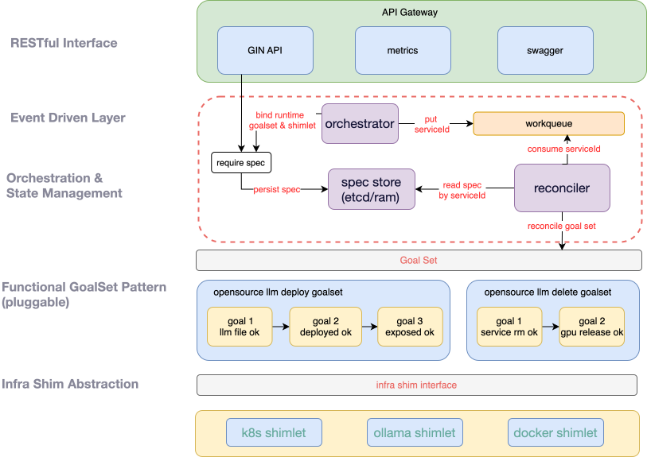

<div align="center">

<br>

[](https://github.com/iflytek/Astron-xmod-shim/blob/main/LICENSE)
[](https://github.com/iflytek/Astron-xmod-shim/releases)
[](https://github.com/iflytek/Astron-xmod-shim/actions)
[](https://github.com/iflytek/Astron-xmod-shim/blob/main/go.mod)
[](https://codecov.io/gh/iflytek/Astron-xmod-shim)
[]()
[](docs/k8s.md)
[](charts/)
[](https://cncf.io)
[](docs/metrics.md)
[](https://github.com/iflytek/Astron-xmod-shim/graphs/contributors)
[](https://github.com/iflytek/Astron-xmod-shim)
[](http://makeapullrequest.com)

<span style="font-size:0.9em; color:#586375;">**Language**: [English](README_en.md) | **简体中文**</span>
</div>

# Astron-xmod-shim

轻量级、声明式的 AI 服务管控中间件

## 项目概述

Astron-xmod-shim 是一个 Goal 驱动的声明式 AI 服务管控中间件：它将用户声明的 DeploySpec 编排为可验证、幂等的 GoalSet——开箱支持
LLM 部署等标准场景，也允许第三方扩展任意自定义 GoalSet；每个 Goal 的具体执行由 Shimlet 插件对接底层运行时（如
Kubernetes、Docker），通过统一的收敛引擎实现跨环境可靠交付。

## 🌟 核心设计理念：从意图到最终一致

Astron-xmod-shim 的设计围绕一个核心思想：**部署即收敛到一组明确目标（Goals）**。  
系统不规定“必须检查什么”，只提供“如何可靠地收敛到你定义的目标”。

- **部署意图：`DeploySpec`（用户侧）**  
  用户通过 `DeploySpec` 声明“要什么”，例如：
  > “部署一个名为 `qwen-test` 的模型服务，1 个副本，使用 1 张 NVIDIA GPU，模型使用 `qwen3-1.5b`。”  
  `DeploySpec` 是纯意图描述，不包含实现细节或环境绑定，确保接口简洁、平台无关。

- **`Goal`、`GoalSet` 与执行引擎**
    1. **`Goal`** 是一个明确的系统目标/收敛路径（如“模型文件存在”），包含：
        - `IsAchieved()`：判断目标是否已达成；
        - `Ensure()`：若未达成，则执行幂等修复动作。
    2. **`GoalSet`** 是一组有序 `Goal` 的集合，代表某类部署场景（如 LLM 上线、服务下线）的收敛路径。其内容完全开放，支持第三方扩展。
    3. **执行引擎**由 **`WorkQueue` + `reconcile loop`** 构成：
        - `WorkQueue` 提供可靠调度（去重、限速重试、背压控制）；
        - `reconcile loop` 持续消费任务，逐个收敛 `Goal`，直至状态一致。

- **`Shimlet`（运行时适配插件）**  
  `Shimlet` 实现 `shim.Runtime` 接口，封装底层环境（如 Kubernetes、Docker）的资源操作，通过接口抽象实现运行时解耦，支持多环境无缝切换。

- **轻量单体架构**  
  单二进制交付，无外部依赖，适用于边缘、本地及云原生等多种部署场景。

## 🏗️ 技术架构

Astron-xmod-shim 采用“核心引擎 + 双插件”的解耦架构，通过抽象层与流程引擎分离关注点，实现高可扩展性与环境无关性。



## 快速开始

### 环境要求

- Go 1.24+（开发环境）
- 目标环境（如 K8s v1.19+，如需使用 K8s shimlet）


### Helm部署

Astron-xmod-shim 也提供了 Helm Chart 部署方式，适用于 Kubernetes 环境。

#### 前提条件

- 已安装 Helm 3.x
- 已配置 kubectl 连接到目标 Kubernetes 集群
- 主机上已存在配置目录和模型目录

#### 部署命令

```bash
# 进入 Helm chart 目录
cd deploy/helm

# 安装应用
 helm install astron-xmod-shim  ./astron-xmod-shim   --kubeconfig  ../../conf/shimlets/kubeconfig 
# 升级应用
 helm upgrade astron-xmod-shim  ./astron-xmod-shim   --kubeconfig  ../../conf/shimlets/kubeconfig 
# 卸载应用
 helm uninstall astron-xmod-shim    --kubeconfig  ../../conf/shimlets/kubeconfig 
# 验证部署
kubectl get pods -l app.kubernetes.io/name=astron-xmod-shim
```

#### Helm Chart 主要特性

- 使用主机网络模式运行
- 挂载项目配置文件到容器的`/app/conf`目录
- 挂载主机模型目录`/mnt/maasmodels/`到容器相同路径
- 支持 k8sshimlet 配置文件挂载

#### 自定义配置

如需修改默认配置，可以通过以下方式：

1. **修改 values.yaml 文件**
   ```bash
   vi deploy/helm/astron-xmod-shim/values.yaml
   ```

2. **使用自定义 values 文件**
   ```bash
   helm upgrade --install astron-xmod-shim deploy/helm/astron-xmod-shim/ -f your-custom-values.yaml
   ```

#### 卸载

```bash
helm uninstall astron-xmod-shim
```

## API 参考文档
[API参考文档](deploy/docs/api.md)

## 插件开发指南

### Shimlet 开发（环境适配插件）

Shimlet 负责将抽象的部署请求转换为具体环境的操作。以下是开发自定义 shimlet 的示例：

#### 内置示例：Kubernetes Shimlet

Astron-xmod-shim 原生内置了 Kubernetes Shimlet，用于在 Kubernetes 环境中部署模型服务。它实现了标准的 Shimlet 接口，能够将抽象部署请求转换为
Kubernetes 的资源操作（如创建 Deployment 和 Service 等）。

#### 扩展示例：Docker Shimlet 实现
[自定义Shimlet示例](deploy/docs/shimlet-demo.md)


### 预定义收敛目标集合（GoalSet）

GoalSet 定义了模型部署的具体目标和执行逻辑。Astron-xmod-shim 使用 Builder 模式实现 GoalSet，以下是开发自定义 GoalSet 的示例：

#### 内置示例：OpenSourceLLM GoalSet

Astron-xmod-shim 原生内置了 OpenSourceLLM GoalSet，用于开源大模型的部署流程。它采用 Builder
模式实现，包含模型路径映射、部署完成验证、规格一致性检查和服务暴露等关键目标，使用户能够快速部署开源大模型服务。


### 扩展示例：业务场景 GoalSet

开发者可以根据具体业务需求创建专用的GoalSet。例如：

- **多模态模型服务GoalSet**：增加针对文本和图像处理的特殊验证目标、优化GPU分配策略、配置专用推理参数
- **边缘部署GoalSet**：添加资源限制检查、模型量化优化、离线推理支持等特殊目标
- **企业级安全GoalSet**：集成身份验证、加密传输、访问控制等安全增强目标

[自定义GoalSet示例](deploy/docs/goalset-demo.md)


## 配置文件结构说明

Astron-xmod-shim 支持通过命令行参数和配置文件进行配置：
[配置文件整体说明](deploy/docs/conf.md)


## 贡献指南

我们欢迎社区贡献，贡献前请阅读以下指南：

1. Fork 仓库并创建自己的分支
2. 遵循项目代码规范（使用 pre-commit 进行代码风格检查）
3. 提交代码前确保通过所有测试
4. 提交 Pull Request，描述清楚所做的变更和解决的问题

## 🌟 Star 历史

<div align="center">
  
</div>

## 许可证

Astron-xmod-shim 使用 Apache License 2.0 许可证。

## 联系我们

如有问题或建议，请通过以下方式联系我们：

- GitHub Issues: https://github.com/iflytek/astron-xmod-shim/issues
- Email: hxli28@iflytek.com