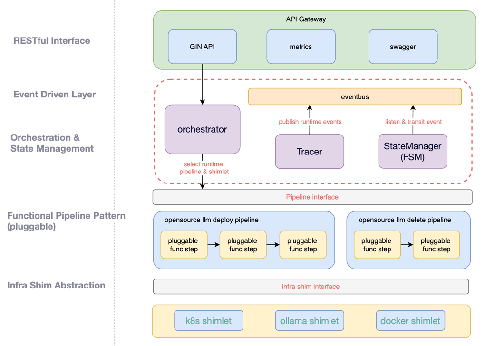

# ModelServeShim

## 项目概述
ModelServeShim 是一款轻量级 AI 服务管控中间件，采用插件化架构设计，旨在简化大模型服务的部署、运维与管理流程。通过抽象环境适配层（shimlet）和可扩展部署流程（pipeline），实现跨环境统一管控能力，支持快速集成新的部署环境和自定义模型部署流程。

## 核心特性
- **插件化跨环境适配**：基于 shim 抽象层设计，通过 shimlet 插件实现不同环境的无缝适配
- **可定制部署流程**：基于 pipeline 插件架构，支持自定义模型部署步骤和流程
- **轻量高效**：单二进制文件交付，无外部依赖，资源占用低
- **全生命周期管理**：支持模型服务的部署、监控、更新和销毁等完整生命周期管理
- **热加载机制**：支持插件热加载，无需重启服务即可更新功能

## 技术架构
ModelServeShim 采用"核心逻辑+双插件"的解耦设计架构，主要包含以下组件：

1. **核心引擎**：负责整体流程协调、状态管理和 API 提供
2. **Shim 抽象层**：定义标准化接口，屏蔽底层环境差异
3. **Pipeline 引擎**：管理模型部署的各阶段流程和步骤
4. **插件管理系统**：负责插件的加载、卸载和生命周期管理



### 核心组件说明
- **核心引擎**：处理 API 请求，管理服务状态，协调各组件工作
- **Shim 层**：通过统一接口定义，实现对不同环境（如 K8s、Docker）的适配
- **Pipeline 层**：定义和执行模型部署的各个步骤，如模型验证、配置渲染、资源部署等
- **状态管理**：基于有限状态机实现服务状态的可靠流转和跟踪

## 快速开始
### 环境要求
- Go 1.20+（开发环境）
- 目标环境（如 K8s v1.20+，如需使用 K8s shimlet）

### 安装
```bash
# 下载二进制文件（Linux x86_64）
wget https://github.com/iflytek/modserv-shim/releases/latest/download/model-serve-shim
chmod +x model-serve-shim

# 或从源码构建
git clone https://github.com/iflytek/modserv-shim.git
cd modserv-shim
make build
```

### 基本使用
```bash
# 启动服务，加载 K8s shimlet 和开源 LLM 部署流程
./model-serve-shim --port=8080 \    
  --shimlet=k8s \                  
  --pipeline=opensourcellm          
```

## API 参考
### 部署模型服务
```bash
curl -X POST http://localhost:8080/api/v1/modserv/deploy \   
  -H "Content-Type: application/json" \                      
  -d '{                                                      
    "modelName": "example-model",                         
    "modelFile": "/path/to/model",                        
    "resourceRequirements": {                              
      "acceleratorType": "NVIDIA GPU",                    
      "acceleratorCount": 1,                               
      "cpu": "4",                                         
      "memory": "16Gi"                                    
    },                                                       
    "replicaCount": 1                                       
  }'                                                         
```

### 查询服务状态
```bash
curl http://localhost:8080/api/v1/modserv/{serviceId}
```

### 列出已加载插件
```bash
curl http://localhost:8080/api/v1/plugins
```

## 插件开发指南
### Shimlet 开发（环境适配插件）
Shimlet 负责将抽象的部署请求转换为具体环境的操作。以下是开发自定义 shimlet 的示例：

#### 内置示例：Kubernetes Shimlet
ModelServeShim 原生内置了 Kubernetes Shimlet，用于在 Kubernetes 环境中部署模型服务。它实现了标准的 Shim 接口，能够将抽象部署请求转换为 Kubernetes 的资源操作（如创建 Deployment 和 Service 等）。

#### 步骤 1：实现 Shim 接口
```go
package myshimlet

import (
    "context"
    "modserv-shim/internal/core/deploy"
)

// MyShimlet 实现自定义环境适配插件
type MyShimlet struct{}

// Create 创建资源
func (s *MyShimlet) Create(ctx *deploy.Context) (string, error) {
    // 实现创建资源的逻辑
    // 返回资源 ID
    return "resource-id", nil
}

// Status 查询资源状态
func (s *MyShimlet) Status(resourceID string) (deploy.Status, error) {
    // 实现查询资源状态的逻辑
    return deploy.StatusRunning, nil
}

// Delete 删除资源
func (s *MyShimlet) Delete(resourceID string) error {
    // 实现删除资源的逻辑
    return nil
}

// GetResourceInfo 获取资源详细信息
func (s *MyShimlet) GetResourceInfo(resourceID string) (map[string]interface{}, error) {
    // 实现获取资源详细信息的逻辑
    return map[string]interface{}{"id": resourceID}, nil
}
```

#### 步骤 2：注册插件
```go
package myshimlet

import (
    "modserv-shim/internal/core/plugin"
)

// init 函数在插件加载时自动调用
func init() {
    // 注册自定义 shimlet
    plugin.RegisterShimlet("my-shimlet", &MyShimlet{})
}
```

### Pipeline 开发（部署流程插件）
Pipeline 定义了模型部署的具体步骤和执行逻辑。ModelServeShim 使用 Builder 模式实现 Pipeline，以下是开发自定义 pipeline 的示例：

#### 内置示例：OpenSourceLLM Pipeline
ModelServeShim 原生内置了 OpenSourceLLM Pipeline，用于开源大模型的部署流程。它采用 Builder 模式实现，包含生成服务ID、映射模型名称到路径、应用服务配置和暴露服务端点等关键步骤，使用户能够快速部署开源大模型服务。

#### 步骤 1：定义 Pipeline 步骤函数
```go
package mypipeline

import (
    "modserv-shim/internal/core/pipeline"
    "modserv-shim/pkg/log"
)

// 定义 pipeline 步骤函数，类型为 func(*pipeline.Context) error

// validateModel 验证模型有效性
func validateModel(ctx *pipeline.Context) error {
    log.Info("开始验证模型: %s", ctx.DeploySpec.ModelName)
    // 实现模型验证逻辑
    return nil
}

// processConfig 处理部署配置
func processConfig(ctx *pipeline.Context) error {
    log.Info("处理部署配置")
    // 实现配置处理逻辑
    return nil
}

// prepareResources 准备部署资源
func prepareResources(ctx *pipeline.Context) error {
    log.Info("准备部署资源")
    // 实现资源准备逻辑
    return nil
}
```

#### 步骤 2：创建并注册 Pipeline
```go
package mypipeline

import (
    "modserv-shim/internal/core/pipeline"
)

// init 函数在插件加载时自动调用
func init() {
    // 使用 Builder 模式创建并注册自定义 pipeline
    myCustomPipeline()
}

// myCustomPipeline 创建自定义 pipeline 实例
func myCustomPipeline() *pipeline.Pipeline {
    // 使用 New() 创建 builder，Step() 添加步骤，BuildAndRegister() 完成构建并注册
    return pipeline.New("my-pipeline").
        Step(validateModel).
        Step(processConfig).
        Step(prepareResources).
        BuildAndRegister()
}
```

### 扩展示例：Docker Shimlet
除了内置的Kubernetes Shimlet外，开发者还可以实现Docker环境适配插件，将模型服务部署到Docker容器中。Docker Shimlet通过Docker API创建和管理容器，支持模型服务的完整生命周期管理。

### 扩展示例：业务场景 Pipeline
开发者可以根据具体业务需求创建专用的Pipeline。例如：
- **多模态模型服务Pipeline**：增加针对文本和图像处理的特殊验证步骤、优化GPU分配策略、配置专用推理参数
- **边缘部署Pipeline**：添加资源限制检查、模型量化优化、离线推理支持等特殊步骤
- **企业级安全Pipeline**：集成身份验证、加密传输、访问控制等安全增强功能

### 插件集成方式

ModelServeShim 使用 Go 语言的初始化注册机制实现插件集成，而不是通过共享库编译和热加载。

#### 内置插件集成
内置插件（如 Kubernetes Shimlet）通过在 `init()` 函数中自动注册到框架中：
```go
// K8sShimlet 的注册方式示例
func init() {
    shimlet.Registry.AutoRegister(&K8sShimlet{})
}
```

#### 自定义插件集成
自定义插件可以通过以下方式集成到 ModelServeShim 中：

1. **实现标准接口**：按照文档中示例实现 `Shimlet` 或 `Pipeline` 接口
2. **自动注册**：在 `init()` 函数中使用注册表完成自动注册
3. **重新编译**：将自定义插件代码放在正确的包路径下，然后重新编译整个应用程序

#### 插件选择与配置
通过命令行参数或配置文件指定要使用的插件：
```bash
# 通过命令行指定插件
./model-serve-shim --shimlet=k8s --pipeline=opensourcellm

# 通过配置文件指定插件
# config.yaml 中设置
defaultShimlet: k8s
defaultPipeline: opensourcellm
```

## 配置说明
ModelServeShim 支持通过命令行参数和配置文件进行配置：

### 命令行参数
```bash
./model-serve-shim --help

Usage of model-serve-shim:
  --port int              服务监听端口 (默认: 8080)
  --config string         配置文件路径
  --shimlet string        默认加载的 shimlet 插件
  --pipeline string       默认加载的 pipeline 插件
  --plugin-dir string     插件目录路径
  --log-level string      日志级别 (debug, info, warn, error) (默认: "info")
```

### 配置文件
配置文件采用 YAML 格式：
```yaml
# config.yaml
service:
  port: 8080
  readTimeout: 30s
  writeTimeout: 30s

plugins:
  defaultShimlet: k8s
  defaultPipeline: opensourcellm
  pluginDir: ./plugins
  preload: 
    - type: shimlet
      path: ./plugins/myshimlet.so
    - type: pipeline
      path: ./plugins/mypipeline.so

logging:
  level: info
  format: text
  output: stdout
```

## 贡献指南
我们欢迎社区贡献，贡献前请阅读以下指南：

1. Fork 仓库并创建自己的分支
2. 遵循项目代码规范（使用 pre-commit 进行代码风格检查）
3. 提交代码前确保通过所有测试
4. 提交 Pull Request，描述清楚所做的变更和解决的问题

## 许可证
ModelServeShim 使用 Apache License 2.0 许可证。

## 联系我们
如有问题或建议，请通过以下方式联系我们：
- GitHub Issues: https://github.com/iflytek/modserv-shim/issues
- Email: hxli28@iflytek.com